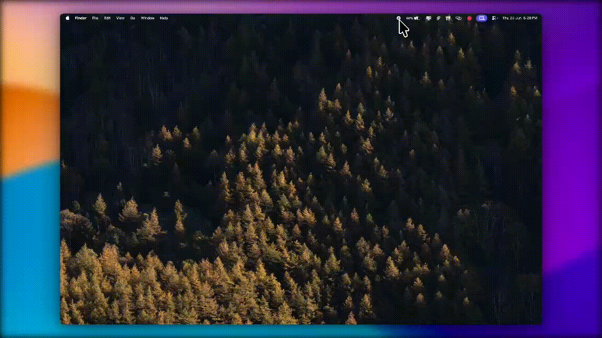
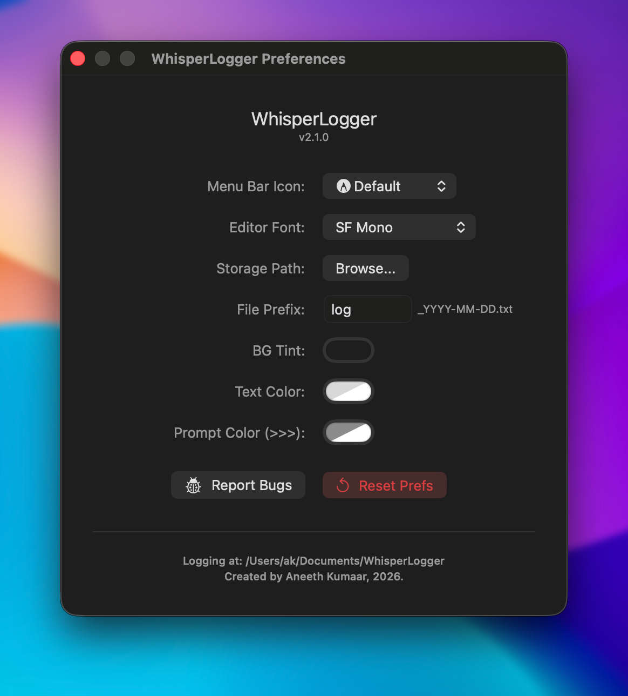
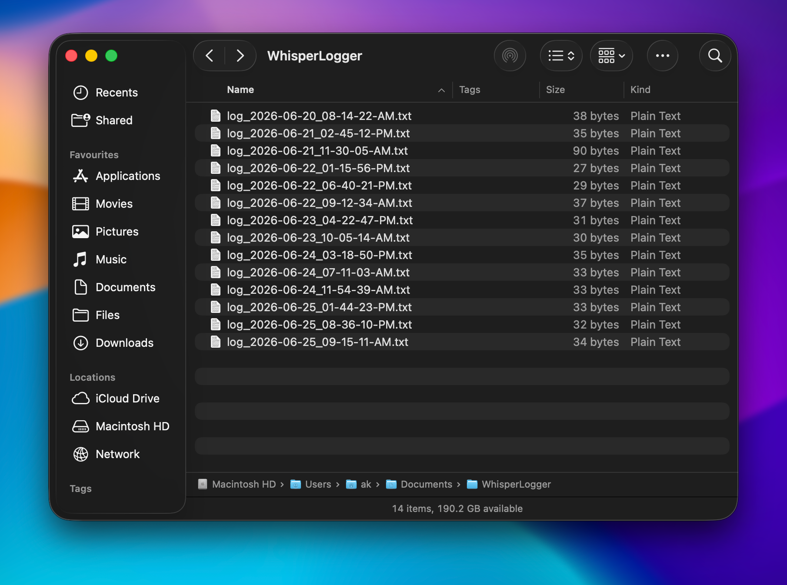

# WhisperLogger

A lightweight, native macOS menu bar utility designed for rapid, distraction-free text logging. Type your thoughts, hit submit, and keep moving. Ideal for developers, researchers, and productivity enthusiasts who need to maintain structured chronological journals without opening a heavy text editor.

---

## Features

* **Menu Bar Resident:** Lives entirely in your status bar—accessible instantly from anywhere via a clean popover.
* **Smart Keyboard Shortcuts:**
  * `⌘ + Return`: Instantly appends your text entry with a custom timestamp.
  * `⌘ + Shift + Return`: Creates a fresh, uniquely timestamped log file and appends your entry right into it.
  * `⌘ + O`: Opens the working directory.
  * `⌘ + ,`: Opens the Preferences Window.
  * `Escape`: Instantly dismisses the input window.
* **Granular Customization:** * Adjustable font pairings (e.g., *JetBrains Mono*, *SF Mono*).
  * Flexible naming layout options, custom prefix formatting, and double-line spacing controls.
  * Complete UI theme color control (Background tint, text color, and prompt decorators).
* **Local & Secure:** Zero analytics, tracking, or cloud sync. Your data remains strictly local in plain `.txt` format.

---

## Installation & First Launch

1. Go to the [Releases](https://github.com/akwastaken/WhisperLogger/releases) page and download the latest `WhisperLogger_<version>.dmg`.
2. Unzip the file and drag **WhisperLogger.app** into your `Applications` folder.

> **Note on macOS Security (Gatekeeper):**
> Because WhisperLogger is distributed independently outside the Mac App Store without an Apple Developer profile signature, macOS will show a warning on first launch (*"App cannot be opened because it is from an unidentified developer"*).
> 
> **To open it:** Go to Settings > Privacy > Scroll down to Security, and click "Open Anyway".

---

## Interface Preview

### Core Logging Popover

### Preferences & Customization

### Output Logs

